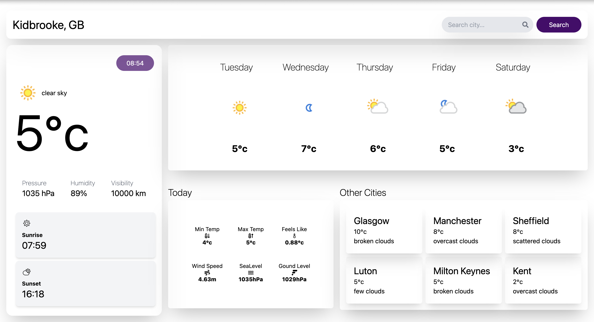
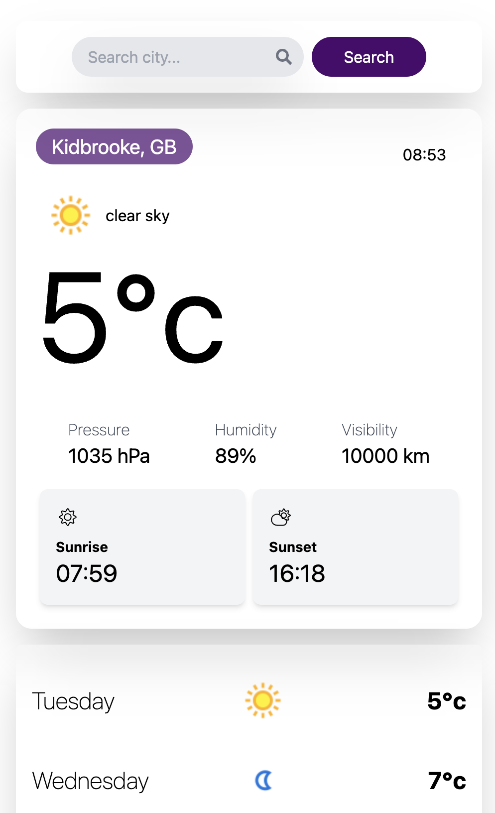

# Weather Application

## Table of Contents

- [Weather Application](#weather-application)
  - [Table of Contents](#table-of-contents)
  - [Overview and Features](#overview-and-features)
  - [Tech Stack](#tech-stack)
  - [Set up and installation](#set-up-and-installation)
  - [Deployment](#deployment)
  - [Testing](#testing)

## Overview and Features

This weather web application provides users with real-time weather information for any city. It includes a current weather display, a 5-day forecast, and city search functionality.
• 5-Day Weather Forecast for your current Location
• View Weather for Other Cities

[Low Fidelity Wireframe](https://www.figma.com/proto/IcESFaw3pS3CKGNVjXxt9i/Untitled?node-id=4-3&t=8dmk7LGHtvJNcrbC-0&scaling=contain&content-scaling=fixed&page-id=0%3A1)

## Tech Stack

- React + TypeScript
- Axios
- React Query
- Tailwind CSS
- Vitest

## Set up and installation

To run this application locally, you'll need to have Node.js and npm istalled.

1. Create free acount on [Open Weather API](https://openweathermap.org/)
2. create an .env and add you API KEY to a variable named `VITE_OPEN_WEATHER_API_KEY`
3. run `npm install`
4. run `npm run dev`

Running with mock data

1. add `VITE_APP_USE_MOCK_DATA='true'` to .env

## Deployment

Live Demo hosted by Netlify [Click Here](https://ayishas-weather-app-demo.netlify.app/)

## Testing

Vitest Unit Tests - Coverage

Running vitest
console `npm run test`
UI Test Appliction `npm run test:ui`

Lighthouse Accessibility Testing Report
